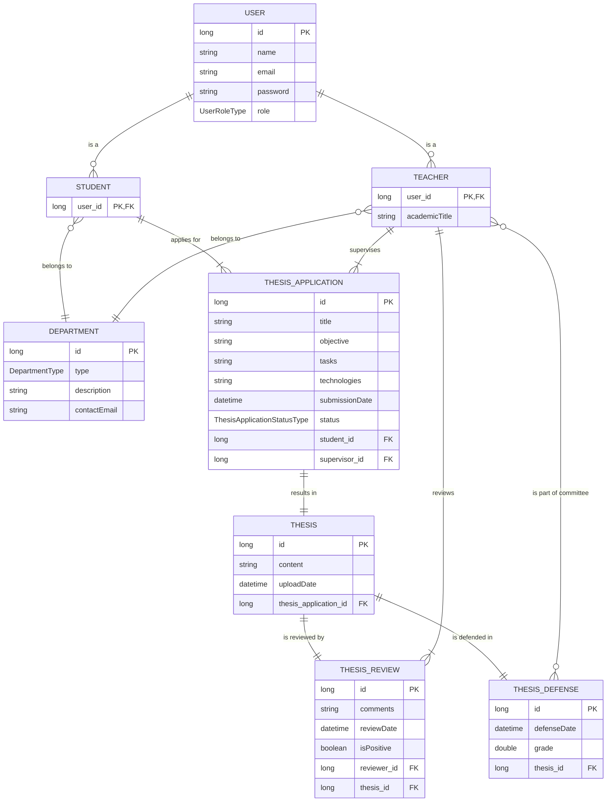

```mermaid
erDiagram
    USER {
        long id PK
        string name
        string email
        string password
        UserRoleType role
    }

    STUDENT {
        long user_id PK, FK
    }

    TEACHER {
        long user_id PK, FK
        string academicTitle
    }

    DEPARTMENT {
        long id PK
        DepartmentType type
        string description
        string contactEmail
    }

    THESIS_APPLICATION {
        long id PK
        string title
        string objective
        string tasks
        string technologies
        datetime submissionDate
        ThesisApplicationStatusType status
        long student_id FK
        long supervisor_id FK
    }

    THESIS {
        long id PK
        string content
        datetime uploadDate
        long thesis_application_id FK
    }

    THESIS_REVIEW {
        long id PK
        string comments
        datetime reviewDate
        boolean isPositive
        long reviewer_id FK
        long thesis_id FK
    }

    THESIS_DEFENSE {
        long id PK
        datetime defenseDate
        double grade
        long thesis_id FK
    }

    USER ||--o{ STUDENT : "is a"
    USER ||--o{ TEACHER : "is a"

    STUDENT }o--|| DEPARTMENT : "belongs to"
    TEACHER }o--|| DEPARTMENT : "belongs to"

    STUDENT ||--|{ THESIS_APPLICATION : "applies for"
    TEACHER ||--|{ THESIS_APPLICATION : "supervises"

    THESIS_APPLICATION ||--|| THESIS : "results in"

    THESIS ||--|| THESIS_REVIEW : "is reviewed by"
    TEACHER ||--|{ THESIS_REVIEW : "reviews"

    THESIS ||--|| THESIS_DEFENSE : "is defended in"
    TEACHER }o--o{ THESIS_DEFENSE : "is part of committee"
```
